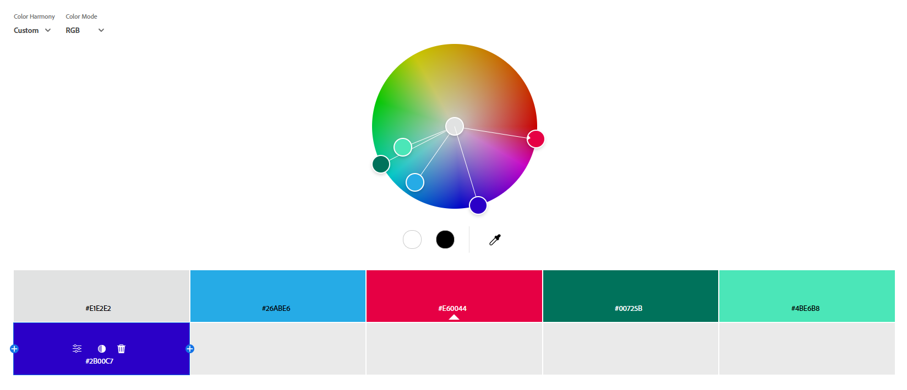

Assignment 1 - Hello World: Basic Deployment w/ Git, GitHub, Render
===

Rohan Gladson Render Website: https://a1-rohangladson.onrender.com/

### Introduction:

This project shows my implementation of Assignment 1 requirements, which is be able to create a simple personal website, and afterward deploy it through GitHub and Render. Throughout my development of website, I would use my skills to tackle the required implementation of technical, such as being able to CSS for website customization or  JavaScript for animations, and design achievements in which I would implement a custom color palette from Adobe Color, and integrating a Google Font.

### Technical Achievement:

### Part 1: CSS Styling

Now when approaching this portion of the assignment, my goal with my approach of CSs styling was to make website look more structured, as it would allow for better readability. The way I went about creating my structure, was by first creating my CSS file ─ custom-style.css, in which I would adjust certain elements of the website, that being: Website Body, Header, Sub-Header(s), Bullet Point and Text Color, and lastly, Website Readability. 

- Body: The way I went about doing this was by establishing all the major components of the body when looking at the website's skeleton draft, which would be: The base text presentation (as in the general text on website), margins. Along with that, in this area we would establish the global font used throughout the website, as well as the general color used for most text, however, we tackle that in more detail in parts 4 and 5.'

- Header | h1: Now one of the major elements of the website, comes down to the website's title, and with this area I primarily focused on adjusting two areas ─ the padding and the margins, as these areas were the only two areas of significance when creating an updated version of the title.

- Subheading | h2: Wit this area, I shared the same principles as the header, with slight changes, as this time I chose to prioritize the spacing both above and below, as well as implanting a dividing line, as it would make distinguishing the sections a little clearer.

- ul | li::marker: When looking at this component separately, it may not hold much significance, however, I was struggling to adjust the bullet points color to that of the texts of bullet point, as they were not synonymous. So the purpose of this style, was to simply change the appearance of list bullets, making them feel more unique to my website instead of the default.

- ul | li: This component was to created to adjust the visual appearance of the text that followed the bullet point, and making it's own separate category versus the general text was all it to have a more unique presence on website.

- Adjusting Readability: This last style was simply an area for me to improve the reading quality of my website, by implementing components that adjust the paragraph line-height, limiting text width, or even simply adjusting list spacing so the information of the website doesn't feel to cluttered.

Lastly, after creating all these components in CSS file, I would then go on to modify index.html and server.js, so as make sure the everything was able to run smoothly, and changes that would be made in the CSS file could automatically be seen on the website after a refresh. The way I went about do this was in the index.html file, I would include the stylesheet with <link rel="stylesheet" href="custom-style.css">. The significance of this is that this would instruct my website to load any of the rules, and when looking at server.js, I would update the file by incorporating another case to file for "/custom-style.css". The significance of this implementation was to make sure that the file was served correctly with the text/CSS MIME type.

Challenge(s) Faced:
- Since I am still relatively new to CSS, as I have been using it for only a couple of months, learning the implementations and methods needing to be used took a me a little longer then anticipated. 
- While I was able to figure generally about how I would have to adjust the html file after my CSS file creation, I did not realize that I would also have to adjust the server.js file as well. I was only able to catch this when initially, none of my styles appeared. It was only after adding a proper case in server.js, that I was able to fix the matter.
- Adjusting the bullet point visual along with the text was a challenge, which I went into further detail above, in the "ul | li::marker" section.

### Part 2: JavaScript Animation

When approaching this part of the assignment, I wanted to create an animation that was noticeable, but also pretty straightforward. I started off, by first creating a JavaScript file ─ simple-animation.js, in which the animation that I was going for the title of my Web page to be constantly moving side-to-side. 

So when looking towards the work I had done in simple-animation.js, what I had done was inside the script, I would first wait for the DOM to load, which would then go on to select the title element. From this I would then introduce the variable, "angle," which I would use to then track the animation state, which I would follow up by defining an "animate()" function. The significance of this function, is that each time it runs, it calculates an offset with "Math.sin(angle) * 25", in which the it produces values that sway between negative 25 and positive 25. What comes of this, is that the offset is then applied to the element using "transform: translateX(...)", and now what happens is a shift in the title horizontally. Lastly, what comes of this is that after applying the transform, the function increases the angle slightly to advance the motion, which then uses "requestAnimationFrame" to call itself again, creating a continuous loop for "swaying" motion.

Now with JavaScript File being created the last step was to adjust index.html and server.js to the new file. For the html file, at the near end, I would implement the following line ─ . The significance of this line is that it explicitly tells my website to load the animation file, and along with the, the defer attribute makes sure that the script would only execute once the HTML content had been fully parsed. This is important, as if this element is not incorporate, them there would be no prevention of errors when trying to access the <h1> element. Now when transitioning to server.js, similar to Part 1, I would implement a case for "/simple-animation.js", in which I would use "sendFile(response, 'simple-animation.js', 'text/javascript')". The significance of this component is that allows for whenever the browser requested the file, it would in turn have the server would respond correctly and specify its MIME type as text or JavaScript. Now, if this case were not implemented, it would result in the server returning a 404 error, which would mean that the animation logic would never reach the website.

Challenge(s) Faced:
- Unlike the last part, where I did not have much knowledge in CSS, I do have a general understanding of how to program in JavaScript. However, I did not know much about how to animate in JavaScript, so learning about the "animate()" function took me a little longer to understand and implement.
- One issue that I was noticing initially when tackling this part of the assignment was that there browser caching, which had it to where older versions of the script to linger. To adjust to this issue, I more so relied on console logs and hard-refreshes to verify changes were working.

### Part 3: Semantic HTML tags

When tackling the last technical component of the assignment, the way I wanted to use my semantic HTML tags was similar to how I approached the CSS portion of the assignment. As in I wanted to continue on with improving the overall structure of the website, but this time, I wanted to rely making my page more clear without having to rely only on "style." So when going about this, the 5 semantic HTML tags that I thought would improve my website would be: header, nav, section, article, and footer.

- header: The significance of this tag, is that it is designed to be at the top page, as it is meant to group the main <h1> title together navigation. What comes of this is that it ensures that both the main title and navigation are more so labeled as introductory elements, rather than scattered pieces of content on the page.

- nav: When you look further into the "header", what you will is the "nav" tag, which is designed to wrap anchor links, which points to ID's on the page. Specifically, when establishing:
* href = "#introduction"
* href = "#technologies"
* href = "#experience"

What we do is allow for "nav" to provide a more quick in-page navigation. While the implementation does not have much more overall significance to my website, as the content is minimal, the practice of implementing quick navigation is important in most website development.

- section: With this semantic tag, what I was looking for was to enclose each major block that we established in "nav": introduction, technologies, and experience. Essentially, what this does in return is that for both the browser and those that use the website, it simply signals that theses areas are distinct units. 

- article: With this semantic tag, I would establish in two areas, specifically I would use to for two sub sections in the "Experience" part of the site. What I was aiming to do was to have one of the article tags warp the academic experience list, and while the other usage of the tag is meant to wrap working experience. Essentially the significance of the article tag is meant to for self-contained pieces of content that could stand alone, so the need for it made sense in this section, as it would distinguish each section in experience from academic and work experience into independent blocks.

- footer: For the last semantic tag that I used, if anything this tag has no overall significance for my website, however, in when looking into how website is traditionally designed, the footer is significant, as represents closing content for the document. In the case of my code, it's implementation is there simply there to close off the information of my created site, as it contains my name, the assignment, and WPI. 

Challenge(s) Faced:
- Unlike the previous section, I would say that I faced the most challenge in this section, as I had more familiar use to CSS and JavaScript. Whereas, with HTML, along with the my work for the assignment, I was also learning about HTML concepts, which led to a further understanding of semantic HTML tags. Essentially, learning and understanding the significance of the semantic implementations was the biggest challenge.

### Design Achievements: 

### Part 4: Create a Color Palette

Unlike the components tackled in the Technical Achievements section, the components tackled in the design achievements sections is very much straightforward with implementation.

So, when looking at this part in particular, I created a six-color palette using Adobe Color, in which I would use the colors from the wheel throughout my website. 

Color Palette:

- NOTE: Incase there are issues that comes with image not rendering, the colors that I got from my color wheel were:

* #E1E2E2
* #01D7E6
* #CE7AE6
* #2B00C7
* #4BE6B8
* #26ABE6

The way in which I approached "coloring" my website would be through using targeted CSS rules in custom-style.css. Specifically, I would the following implementations:
- The website background was set with #26ABE6
- Body text used #E1E2E2
- The main title <h1> used #4BE6B8 
- Subheadings <h2> were styled with #2B00C7
- For lists, both bullet markers and text used #00725B
- Borders and dividers incorporated #E60044 to break up sections visually.

Challenge(s) Faced:
- As mentioned earlier, given this sections straightforward nature, implementing the color's from my custom color palette did not present much issues, as we had already established the CSS format back during the technical achievements section in Part 1. Ultimately, the process was simply taking the hex-values of the color from my color wheel, and then implementing them into their respective locations. The only challenge that came with section, was the adjusting of colors that would work well on my page, but ultimately, that was more of small creative hurdle if anything.

### Part 5: Use a font from Google Fonts in your website.

Similar to Part 4, and the overall Design Achievements section, this two components were much straightforward in approach, and required more of a creative touch than that of the technical elements of the assignment.

Having said that, for this part I implemented the custom font, Libertinus Sans, from Google Fonts to give the site a more unique touch. The process was very simple, as Google themselves would provide enough instruction when planning on using their fonts. Specifically, that Google provided instructions to embed it into the project, as I would start off by first placing the <link> elements provided by Google in the <head> of index.html. The significance of this step is to establish a connection to Google’s font servers, which in turn ensures that the browser fetches the font before rendering the page. Now one of the other components that is important in the implementation process, is the placement, as the embed code is mean to be placed in the <head>, as if the font is linked after my stylesheet, it would result in the CSS rules potentially failing to apply correctly on the first render.

Lastly, to bring together everything, and making sure everything operates properly, I would update custom-style.css so the body tag used "font-family: "Libertinus Sans", sans-serif;". The sigfincace of this is that by applying it at the body level, it in turn has to where the font is implemented to all elements on the page, without needing to duplicate font rules everywhere. 

Challenge(s) Faced:
- As mentioned earlier, as well in the previous, given this sections straightforward nature, implementing a Google Font did not present much issues, as the it was simple as implenting embed code in the html file, as well as slighltly modifying the css file. Ultimately, given the plug in play nature of this section, it presented less of challenge as what I had faced working on any of the techincal challenges. The only challenge that came with section, was coming with font that would look good on a website, and similar to part 4, that was more of small creative hurdle if anything.
